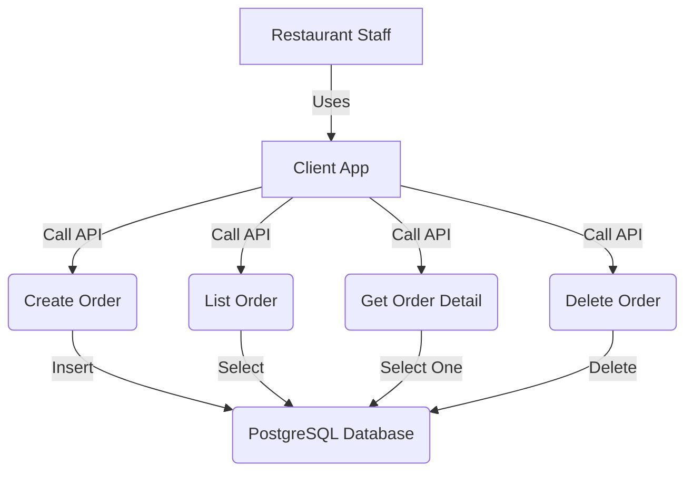
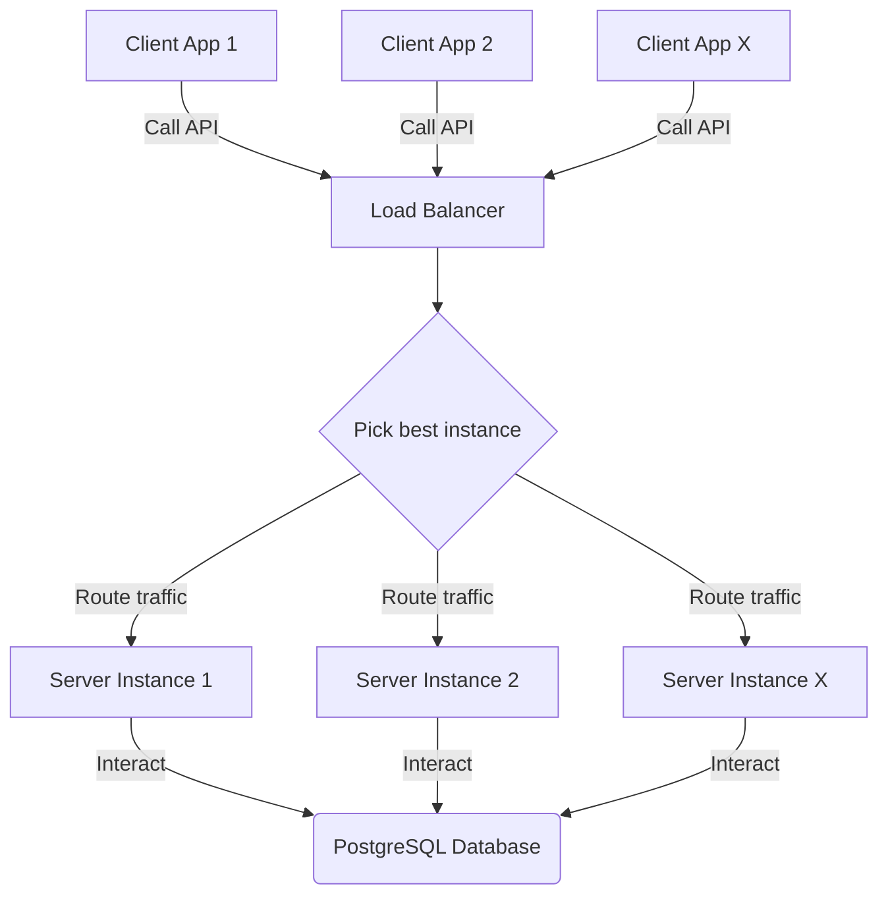
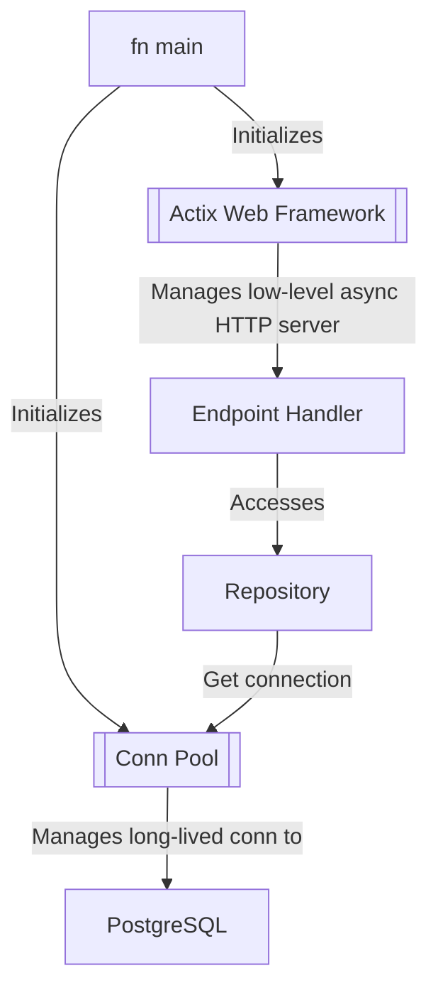

# Sukab Restaurant

The name Sukab is taken from the fictional character made by [famous Indonesian Poet, Seno G. Ajidarma](https://en.wikipedia.org/wiki/Seno_Gumira_Ajidarma).

# System Design

## High level overview

There are three entities in this app: `Table`, `Order` and `Menu`.

A `Table` represents one customer,
it might hold additional metadata that enrich the customer experience.
However, for simplicity's sake, `Table` in this app will only be represented as `table_number`.

An `Order` represents a unique request from `Table`,
it holds information about which `Menu` is chosen,
it also hold information on how long the `cook_time` as minutes,
to simplify, `cook_time` is a random time between `5` to `15` minutes,
to simplify, an `Order` can only hold one `quantity` of a `Menu`.

A `Table` might have one or more `Order`.
An `Order` in a `Table` may be canceled (deleted).

A `Menu` represents the metadata about food/beverage,
it acts as a master data which `Order` can reference via `menu_id`.



Systems and Interactions are represented as the following diagram.
However, a Load Balancer is left out from the actual implementation
because it can be done later in a different layer (for example: Kubernetes `service`).

Server Instance will manage a pool of database connections that has a configurable maximum 
number of connections, so that it can be efficient in reusing idle connections, and to 
prevent resource exhaustion on PostgreSQL side. Moreover, we can also apply additional
`pgbouncer` layer if needed.

To offload the traffic that might came to PostgreSQL database as our traffic increases,
in later iterations a distributed caching layer such as using Redis might be implemented.
Alternatively, we can also implement multi-layer caching with the first layer being in-memory cache
and Redis database as the secondary layer.



## Datastore

I chose to store the orders and menu to a RDBMS, specifically PostgreSQL.
RDBMS was chosen because the requirement of the system is simple enough to
be represented as tables with simple columns and primitive data types.

There are two tables that plays their role in the solution:

`orders` table:

| Column Name    | Type          | Description                            |
|----------------|---------------|----------------------------------------|
| `order_id`     | `bigserial`   | Identifier and Primary Key.            |
| `menu_id`      | `integer`     | Reference to `menus` table.            |
| `table_number` | `integer`     | Table that owns this Order.            |
| `cook_time`    | `integer`     | How long should this take? In minutes. |
| `created_at`   | `timestamptz` | Timestamp when this Order was placed.  |

Index for `orders` table (other than PK):

- `orders_table_number_order_id_index`, composite index from two columns `table_number` and `order_id`,
  this index will be useful for the usecase Delete Order.
- Additional index may be added later, for example,
  a `table_number` index might be added to make usecase List Order to be more performant.

`menus` table:

| Column Name   | Type           | Description                   |
|---------------|----------------|-------------------------------|
| `menu_id`     | `bigserial`    | Identifier and Primary Key.   |
| `name`        | `varchar(300)` | Name of the Menu.             |

## Code Architecture

I follow a simple but modular arch to make sure each component
is having clear responsibility, so that the code is maintainable and extensible
for future product evolution.



## Interfacing via HTTP REST endpoints

There are four HTTP REST endpoints:

| Method | Path | Description |
|--------|------|-------------|
| POST   | `/table/{table_number}/order` | Create new Order. |
| GET    | `/table/{table_number}/order` | List all Orders on a Table. |
| GET    | `/table/{table_number}/order/{order_id}` | Describe an Order on a Table. |
| DELETE | `/table/{table_number}/order/{order_id}` | Delete an Order on a Table. |

# How to Run the tests

Run: `cargo test`.

# How to Run the Server

1. Spin up a PostgreSQL server, a minimum version of PostgreSQL 14 is required.
2. Import the schema and data from the `./src/db/schema/sukab-restaurant.sql` file.
   This file will create:
    - Database `sukab_restaurant`,
    - Table `orders`,
    - Table `menus`.
    - Seed data for `menus` table.
3. Build the app, run `cargo build --release`
4. Set these environment variables:
    ```
    export PG_HOST=localhost
    export PG_USER=<your_user>
    export PG_PWD=<your_pwd>
    ```
5. Run the app by executing this command in the terminal: `./target/release/server`.

# How to Run the Client

1. Make sure the Server is running, if not, follow the guide above.
2. Run the app by executing this command in the terminal: `./target/release/client`.

# Appendix 1: Environment Variables

## Server Env Vars

| Key           | Description                                 | Required | Default       |
|---------------|---------------------------------------------|----------|---------------|
|`RUST_LOG`     | env_logger log level/verbosity.             | No  | `debug`            |
|`HTTP_HOST`    | Host for the HTTP server                    | No  | `localhost`        |
|`HTTP_PORT`    | Port for the HTTP server.                   | No  | `8080`             |
|`PG_HOST`      | PostgreSQL host address.                    | Yes | `localhost`        |
|`PG_PORT`      | PostgreSQL port.                            | Yes | `5432`             |
|`PG_USER`      | PostgreSQL username.                        | Yes | `postgres`         |
|`PG_PWD`       | PostgreSQL password.                        | Yes | `<empty_string>`   |
|`PG_DBNAME`    | PostgreSQL database name.                   | No  | `sukab_restaurant` |
|`COOK_TIME_MIN`| Minimum bound to get randomized Cook Time.  | No  | `5`                |
|`COOK_TIME_MAX`| Maximum bound to get randomized Cook Time.  | No  | `15`               |

## Client Env Vars

| Key                  | Description                                          | Required | Default           |
|----------------------|------------------------------------------------------|----|-------------------------|
|`RUST_LOG`            | env_logger log level/verbosity.                      | No | `debug`                 |
|`SERVER_BASE_URL`     | Base URL for the Server                              | No | `http://localhost:8080` |
|`CLIENT_THREAD_COUNT` | Controls how many threads to spawn to send requests. | No | `10`                    |
